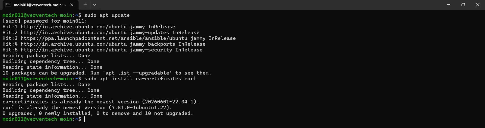
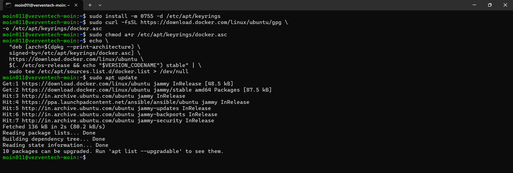
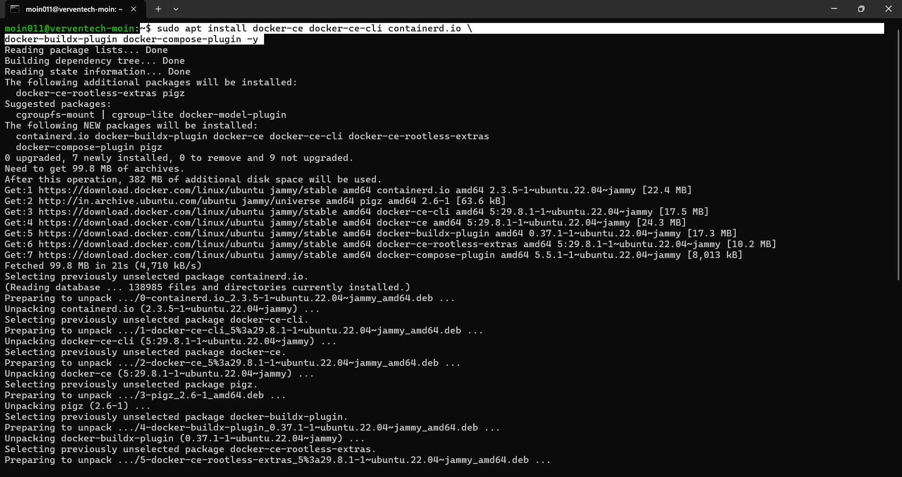
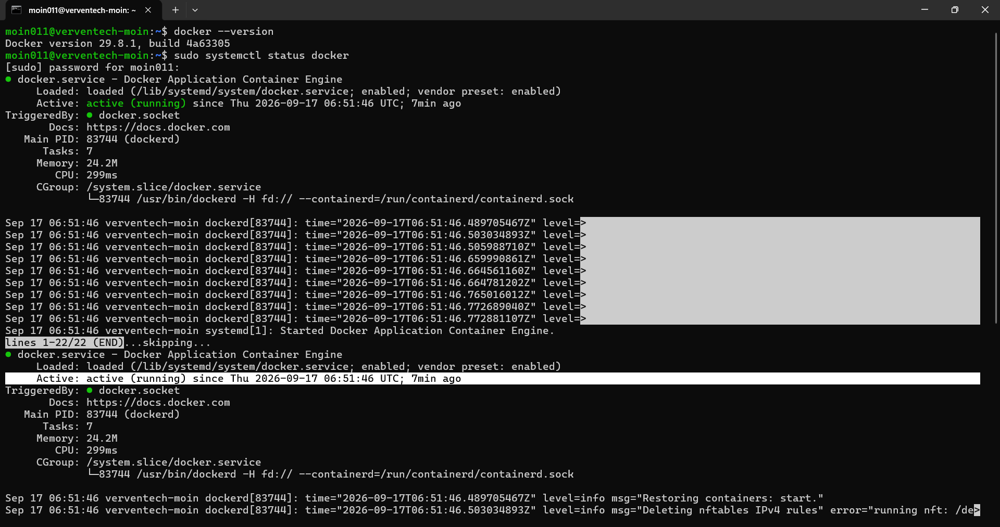

# Docker Installation on Ubuntu

This guide explains how to install Docker Engine on Ubuntu using Docker's official APT repository.

---

## Prerequisites

Before installing Docker, make sure you have:

- Ubuntu Linux
- A user with `sudo` privileges
- An active internet connection

---

## 1. Update System and Install Prerequisites

First, update the system package index:

```bash
sudo apt update
```

Upgrade the installed packages:

```bash
sudo apt upgrade -y
```

Install the required packages:

```bash
sudo apt install ca-certificates curl -y
```

These packages are required to securely download Docker's repository signing key and configure the Docker repository.

### Screenshot



---

## 2. Add Docker GPG Key and Repository

Create the directory for storing APT repository keys:

```bash
sudo install -m 0755 -d /etc/apt/keyrings
```

Download Docker's official GPG key:

```bash
sudo curl -fsSL https://download.docker.com/linux/ubuntu/gpg \
-o /etc/apt/keyrings/docker.asc
```

Set the appropriate permissions:

```bash
sudo chmod a+r /etc/apt/keyrings/docker.asc
```

Add Docker's official repository:

```bash
echo \
  "deb [arch=$(dpkg --print-architecture) \
  signed-by=/etc/apt/keyrings/docker.asc] \
  https://download.docker.com/linux/ubuntu \
  $(. /etc/os-release && echo "$VERSION_CODENAME") stable" | \
  sudo tee /etc/apt/sources.list.d/docker.list > /dev/null
```

Update the package index:

```bash
sudo apt update
```

### Screenshot



---

## 3. Install Docker Engine

Install Docker Engine along with the Docker CLI, containerd, Docker Buildx, and Docker Compose plugin:

```bash
sudo apt install docker-ce docker-ce-cli containerd.io \
docker-buildx-plugin docker-compose-plugin -y
```

The installation includes:

- **Docker Engine** – Container runtime
- **Docker CLI** – Command-line interface
- **containerd** – Container runtime
- **Docker Buildx** – Extended Docker build functionality
- **Docker Compose Plugin** – Docker Compose support

### Screenshot



---

## 4. Verify Docker Installation

After the installation is complete, verify the installed Docker version:

```bash
docker --version
```

Example output:

```text
Docker version XX.XX.X, build XXXXXXX
```

This confirms that Docker has been installed successfully.

---

## 5. Check Docker Service

Check the status of the Docker service using `systemctl`:

```bash
sudo systemctl status docker
```

If Docker is running correctly, the service should display:

```text
Active: active (running)
```

This confirms that the Docker service is installed and currently running.

### Screenshot



---

## Conclusion

Docker Engine has been successfully installed on Ubuntu and the Docker service has been verified.

The installation process covered:

- Updating system packages
- Installing required prerequisites
- Adding Docker's GPG key
- Adding Docker's official APT repository
- Installing Docker Engine and related components
- Verifying the Docker installation
- Checking the Docker service status

Further Docker concepts and practical commands will be documented in separate Markdown files.
