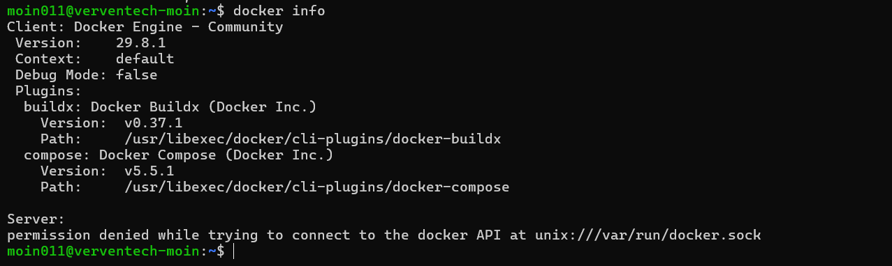
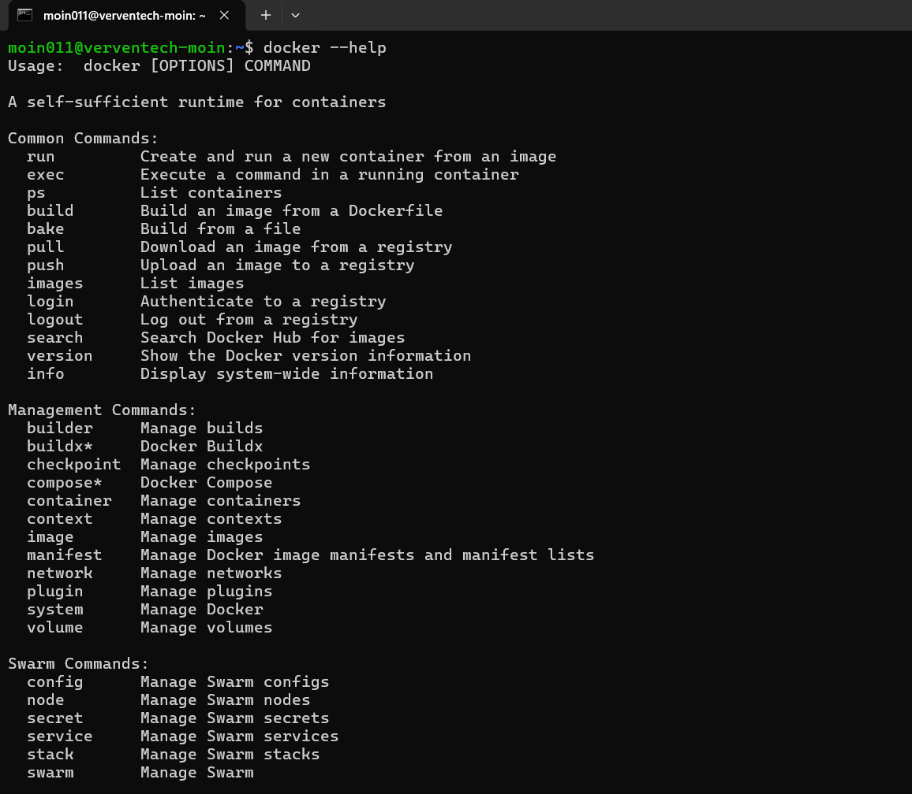
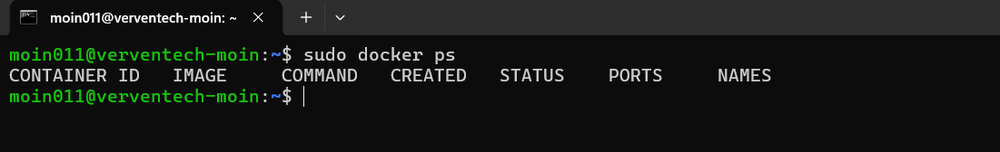
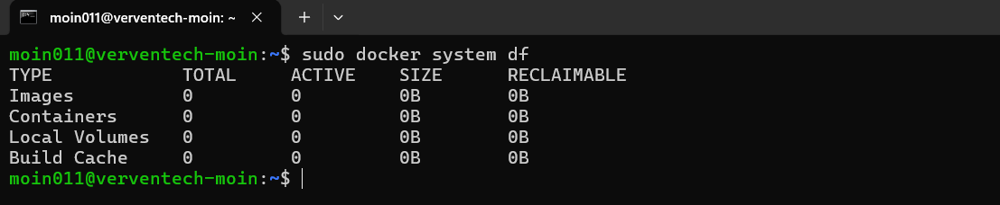
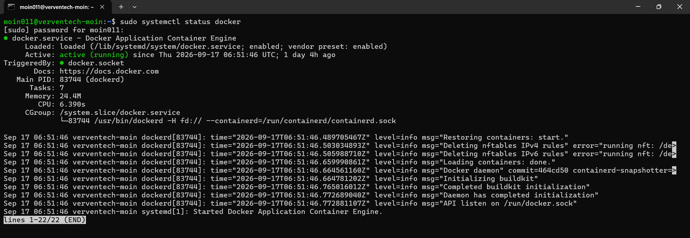

# Docker Commands and Outputs

This document covers commonly used Docker commands along with their outputs and basic usage.

---

## 1. Check Docker Version

The `docker --version` command displays the installed Docker version.

### Command

```bash
docker --version
```

### Purpose

This command is used to verify that Docker is installed and to display the installed Docker version.

### Screenshot


---

## 2. Display Docker System Information

The `docker info` command displays detailed information about the Docker installation and Docker daemon.

### Command

```bash
docker info
```

### Purpose

This command provides detailed information about the Docker environment, including the Docker Server version, containers, images, storage driver, operating system, architecture, CPUs, memory, and runtime information.

### Screenshot



---

## 3. Display Docker Help

The `docker --help` command displays the available Docker commands and options.

### Command

```bash
docker --help
```

### Purpose

This command is useful when learning Docker or checking the available options provided by the Docker CLI.

Common commands shown in the help output include:

- `docker run`
- `docker exec`
- `docker ps`
- `docker build`
- `docker pull`
- `docker push`
- `docker images`
- `docker start`
- `docker stop`
- `docker restart`
- `docker logs`
- `docker inspect`

### Screenshot



---

## 4. List Running Containers

The `docker ps` command displays the containers that are currently running.

### Command

```bash
docker ps
```

### Purpose

This command is used to check currently running Docker containers.

The output can include:

- Container ID
- Image
- Command
- Creation time
- Status
- Ports
- Container name

If no containers are currently running, Docker will display the column headings without any container entries.

### Screenshot



---

## 5. List Docker Images

The `docker images` command displays the Docker images available locally on the system.

### Command

```bash
docker images
```

### Purpose

This command is used to view locally available Docker images.

The output includes:

- Repository
- Image tag
- Image ID
- Creation time
- Image size

### Screenshot


---

## 6. Check Docker Disk Usage

The `docker system df` command displays information about the amount of disk space being used by Docker.

### Command

```bash
docker system df
```

### Purpose

This command provides information about Docker's disk usage, including:

- Images
- Containers
- Local volumes
- Build cache

It can be useful for checking how much storage Docker is consuming on the system.

### Screenshot



---

## 7. Check Docker Service Status

The `systemctl status docker` command is used to check the status of the Docker service.

### Command

```bash
sudo systemctl status docker
```

### Purpose

This command verifies whether the Docker daemon is running.

A successfully running Docker service should show:

```text
Active: active (running)
```

This confirms that the Docker daemon is active and ready to manage containers.

### Screenshot



---

## Summary

| Command | Purpose |
|---|---|
| `docker --version` | Check installed Docker version |
| `docker info` | Display Docker system information |
| `docker --help` | Display Docker CLI help |
| `docker ps` | List running containers |
| `docker images` | List locally available images |
| `docker system df` | Check Docker disk usage |
| `sudo systemctl status docker` | Check Docker service status |

---

## Conclusion

These commands provide a basic introduction to inspecting a Docker installation.

They can be used to verify the Docker installation, inspect the Docker environment, view running containers and images, check Docker disk usage, and verify that the Docker service is running successfully.

Further Docker commands and practical container operations will be documented separately.