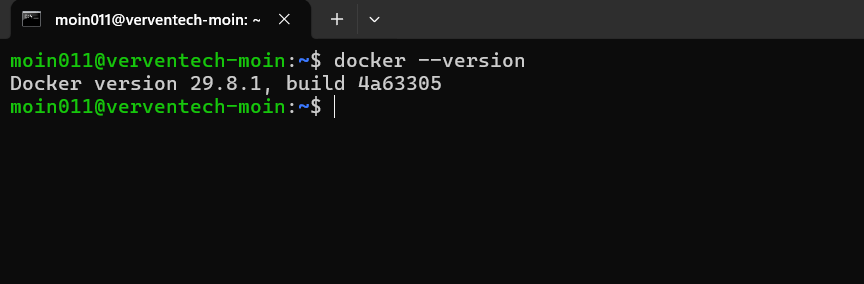
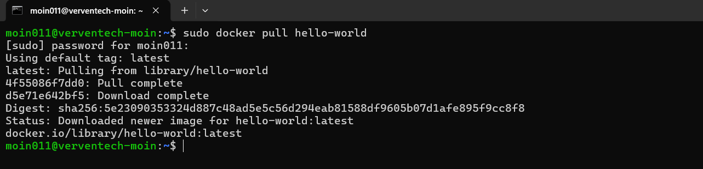
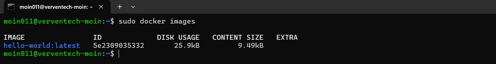
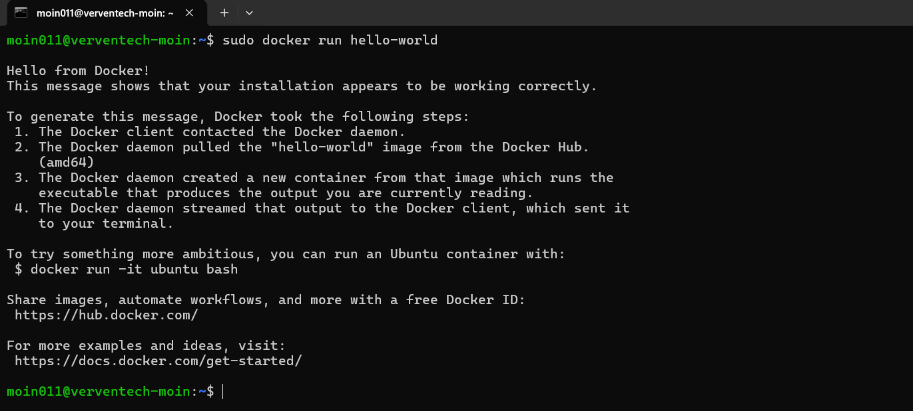
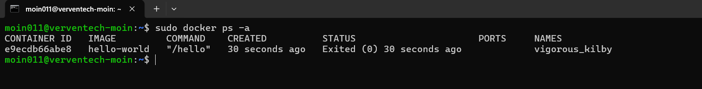
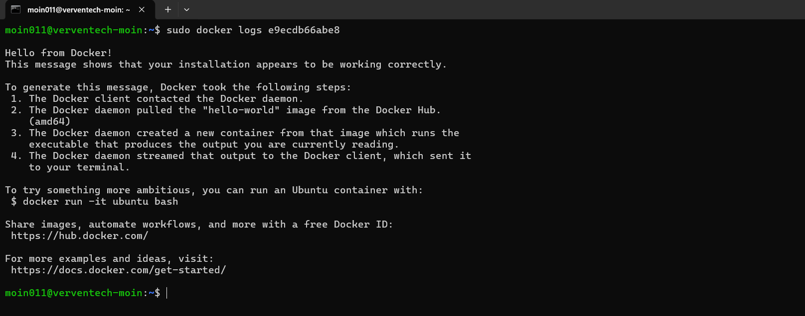

# Run Hello World Container

This guide demonstrates how to pull the official Docker `hello-world` image, run a container from it, verify the container, and view its logs.

---

## Prerequisites

Before starting, make sure:

- Docker Engine is installed.
- Docker service is running.
- The system has an active internet connection.

---

## 1. Check Docker Version

First, verify that Docker is installed and available on the system:

```bash
docker --version
```

This command displays the installed Docker version.

### Screenshot



---

## 2. Pull the Hello World Image

Download the official `hello-world` image from Docker Hub:

```bash
docker pull hello-world
```

Docker checks whether the image is available locally. If it is not present, Docker downloads it from the configured registry.

### Screenshot



---

## 3. Verify the Docker Image

After downloading the image, list the Docker images available locally:

```bash
docker images
```

The `hello-world` image should appear in the list.

The output provides information such as:

- Repository
- Tag
- Image ID
- Creation time
- Image size

### Screenshot



---

## 4. Run the Hello World Container

Run a container using the `hello-world` image:

```bash
docker run hello-world
```

Docker creates a new container from the `hello-world` image and executes it.

The container displays a message beginning with:

```text
Hello from Docker!
```

This confirms that Docker can successfully:

- Find the image locally
- Create a container
- Start the container
- Execute the container
- Display the container output

### Screenshot



---

## 5. Check the Container Status

The `hello-world` container exits after displaying its message. To view the container, including stopped containers, run:

```bash
docker ps -a
```

The output should show the `hello-world` container with an exited status.

An exit code of `0` indicates that the container completed successfully.

### Screenshot



---

## 6. View Container Logs

To view the output generated by the container, use:

```bash
docker logs <CONTAINER_ID>
```

Replace `<CONTAINER_ID>` with the actual container ID shown by:

```bash
docker ps -a
```

For example:

```bash
docker logs 7a8b9c123456
```

The logs should contain the Hello World message generated when the container was executed.

### Screenshot



---

## Summary

The following Docker commands were used:

| Command | Purpose |
|---|---|
| `docker --version` | Check the installed Docker version |
| `docker pull hello-world` | Download the Hello World image |
| `docker images` | List locally available Docker images |
| `docker run hello-world` | Create and run a Hello World container |
| `docker ps -a` | View all containers, including stopped containers |
| `docker logs <CONTAINER_ID>` | View the output generated by a container |

---

## Conclusion

The `hello-world` Docker container was successfully pulled, executed, and verified.

This demonstrates the basic Docker workflow:

```text
Docker Image
     ↓
docker pull
     ↓
Local Image
     ↓
docker run
     ↓
Container
     ↓
Container Output
     ↓
docker logs
```

The successful execution of the Hello World container confirms that the Docker installation is functioning correctly.
