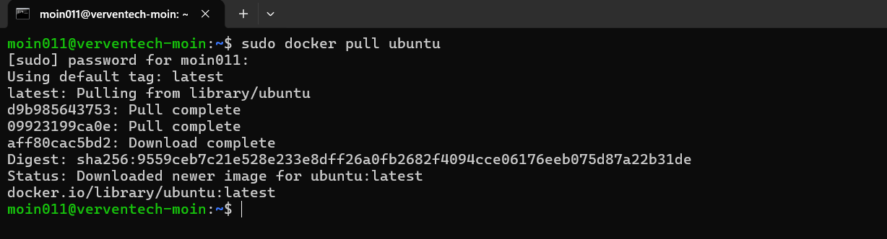
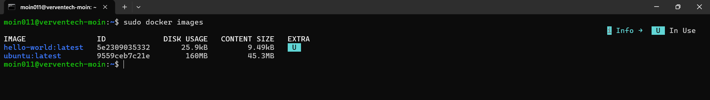
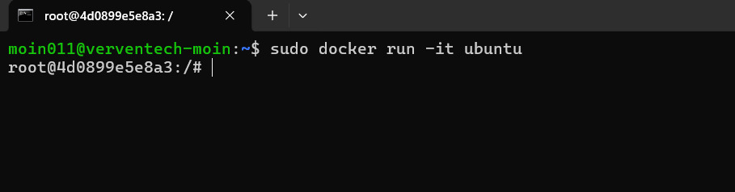
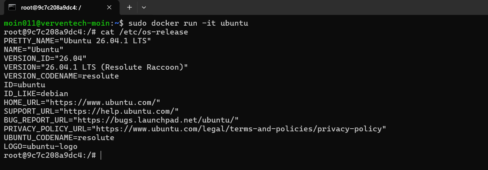
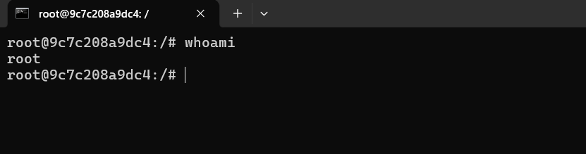
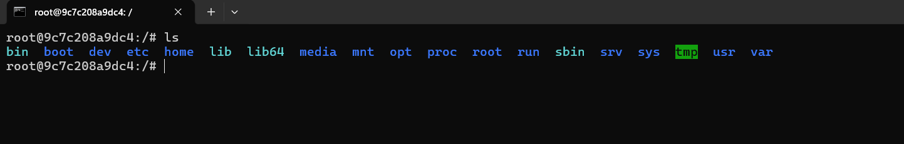
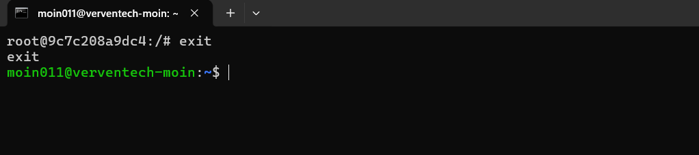

# Run Ubuntu Interactive Container

This guide demonstrates how to pull the Ubuntu Docker image, run an Ubuntu container in interactive mode, inspect the container environment, and exit the container.

---

## Prerequisites

Before starting, make sure:

- Docker Engine is installed.
- Docker service is running.
- The system has an active internet connection.

---

## 1. Pull the Ubuntu Image

Download the official Ubuntu image from Docker Hub:

```bash
docker pull ubuntu
```

This command downloads the Ubuntu image and stores it locally so that it can be used to create containers.

### Screenshot



---

## 2. Verify the Ubuntu Image

List the Docker images available on the local system:

```bash
docker images
```

The `ubuntu` image should appear in the list.

The output includes information such as:

- Repository
- Tag
- Image ID
- Creation time
- Image size

### Screenshot



---

## 3. Run Ubuntu in Interactive Mode

Run the Ubuntu container using interactive and terminal options:

```bash
docker run -it ubuntu
```

The `-i` option keeps the standard input open, while the `-t` option allocates a pseudo-terminal.

After executing the command, you will enter the Ubuntu container and see a prompt similar to:

```text
root@xxxxxxxxxxxx:/#
```

This indicates that you are now working inside the Ubuntu container.

### Screenshot



---

## 4. Check the Ubuntu Operating System

While inside the container, run:

```bash
cat /etc/os-release
```

This command displays information about the operating system running inside the container.

The output includes details such as:

- Operating system name
- Version
- Version ID
- Distribution information

### Screenshot



---

## 5. Check the Current User

Check which user is currently active inside the container:

```bash
whoami
```

The output should normally be:

```text
root
```

Docker containers created from the default Ubuntu image normally start with the root user.

### Screenshot



---

## 6. Explore the Container Filesystem

List the directories available in the container's root filesystem:

```bash
ls
```

You should see standard Linux directories such as:

```text
bin
boot
dev
etc
home
lib
media
mnt
opt
proc
root
run
sbin
srv
sys
tmp
usr
var
```

These directories form the basic filesystem environment inside the container.

### Screenshot



---

## 7. Exit the Ubuntu Container

To leave the interactive Ubuntu container, run:

```bash
exit
```

This exits the container's interactive shell and returns you to the host system's terminal.

### Screenshot



---

## Summary

The following commands were used in this practical:

| Command | Purpose |
|---|---|
| `docker pull ubuntu` | Download the Ubuntu Docker image |
| `docker images` | List locally available Docker images |
| `docker run -it ubuntu` | Start an interactive Ubuntu container |
| `cat /etc/os-release` | Display operating system information |
| `whoami` | Display the current user |
| `ls` | List files and directories |
| `exit` | Exit the interactive container |

---

## Understanding `docker run -it`

The command:

```bash
docker run -it ubuntu
```

combines two options:

- **`-i` (interactive)** – Keeps standard input open so commands can be entered into the container.
- **`-t` (TTY)** – Allocates a pseudo-terminal, providing an interactive shell experience.

Together, these options allow you to interact directly with the Ubuntu container through the terminal.

---

## Conclusion

An Ubuntu Docker container was successfully pulled and started in interactive mode.

Inside the container, the operating system, current user, and filesystem were inspected before exiting back to the host system.

This practical demonstrates the basic workflow of running and interacting with a Linux-based Docker container.