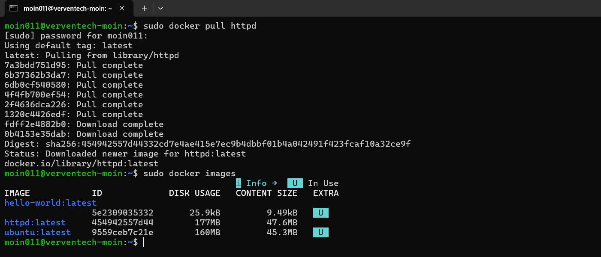
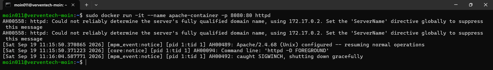
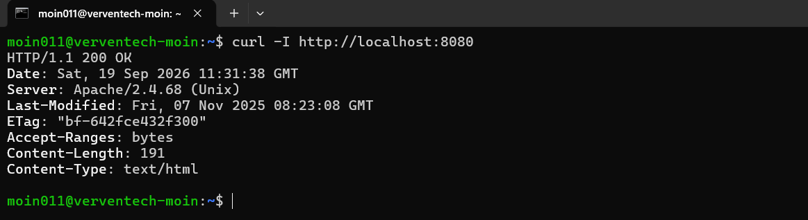
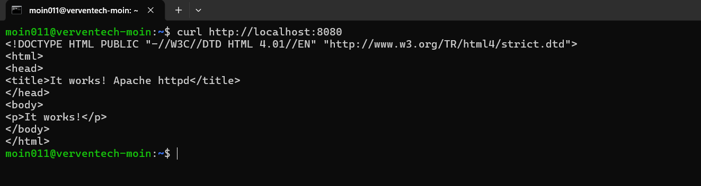
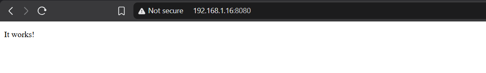

# 52 — Run Apache Interactive Container

This exercise demonstrates how to pull the Apache HTTP Server Docker image, run Apache in an interactive container, expose the Apache service through a host port, and verify the web server using `curl` and a web browser.

---

## 1. Pull the Apache HTTP Server Image

First, pull the official Apache HTTP Server image from Docker Hub.

### Command

```bash
sudo docker pull httpd
```

The `httpd` image is the official Apache HTTP Server image.

The command downloads the required image layers and creates the local `httpd:latest` image.

### Screenshot



---

## 2. Verify the Apache Image

After pulling the image, verify that it is available locally.

### Command

```bash
sudo docker images
```

The output shows the Apache image:

```text
httpd:latest
```

along with the other Docker images available on the system.

### Screenshot


---

## 3. Run Apache in an Interactive Container

Create and start an Apache container using the `httpd` image.

### Command

```bash
sudo docker run -it --name apache-container -p 8080:80 httpd
```

### Command Breakdown

| Option | Description |
|---|---|
| `docker run` | Creates and starts a new container |
| `-it` | Runs the container interactively |
| `--name apache-container` | Assigns a name to the container |
| `-p 8080:80` | Maps host port `8080` to container port `80` |
| `httpd` | Uses the Apache HTTP Server image |

The port mapping is:

```text
Host Port 8080  →  Container Port 80
```

Apache listens on port `80` inside the container.

### Apache Output

When the container starts, Apache reports:

```text
Apache/2.4.68 (Unix) configured -- resuming normal operations
Command line: 'httpd -D FOREGROUND'
```

The following warning is also displayed:

```text
AH00558: httpd: Could not reliably determine the server's fully qualified domain name
```

This is an Apache configuration warning and does not prevent the server from running.

The container was later stopped, which resulted in:

```text
caught SIGWINCH, shutting down gracefully
```

### Screenshot



---

## 4. Test Apache with curl

Once Apache is running, test the web server from the terminal.

### Command

```bash
curl http://localhost:8080
```

Apache returns its default HTML page:

```html
<!DOCTYPE HTML PUBLIC "-//W3C//DTD HTML 4.01//EN"
"http://www.w3.org/TR/html4/strict.dtd">
<html>
<head>
<title>It works! Apache httpd</title>
</head>
<body>
<p>It works!</p>
</body>
</html>
```

The response confirms that Apache is serving the default webpage successfully.

### Screenshot



---

## 5. Check the HTTP Response Headers

Use `curl -I` to display only the HTTP response headers.

### Command

```bash
curl -I http://localhost:8080
```

The server returns:

```text
HTTP/1.1 200 OK
Server: Apache/2.4.68 (Unix)
Content-Type: text/html
```

The `200 OK` status indicates that the HTTP request was successfully processed.

### Screenshot



---

## 6. Access Apache from a Web Browser

The Apache server can also be accessed directly from a web browser.

In this setup, the server was accessed through:

```text
http://192.168.1.16:8080
```

The browser displays:

```text
It works!
```

This confirms that the Apache web server is accessible through the exposed host port.

### Screenshot



---

## Key Concepts

### Interactive Container

The `-it` option allows the container to run interactively.

It combines:

```text
-i  → Interactive mode
-t  → Allocate a pseudo-terminal
```

Therefore:

```bash
-it
```

allows interaction with the container's terminal.

---

### Port Mapping

The option:

```bash
-p 8080:80
```

maps port `8080` on the host system to port `80` inside the Apache container.

The connection can be represented as:

```text
Host
192.168.1.16:8080
        │
        ▼
Docker Container
Port 80
        │
        ▼
Apache HTTP Server
```

---

### Apache Foreground Mode

The Apache Docker image runs the server in the foreground:

```text
httpd -D FOREGROUND
```

This allows the Apache process to remain the main process of the container.

---

### Apache ServerName Warning

The following message appeared when Apache started:

```text
AH00558: httpd: Could not reliably determine the server's fully qualified domain name
```

This is a configuration warning related to the Apache `ServerName` setting.

It does not prevent Apache from serving web content, as demonstrated by the successful `curl` request and browser response.

---

## Summary

| Step | Command | Purpose |
|---|---|---|
| 1 | `sudo docker pull httpd` | Download the Apache image |
| 2 | `sudo docker images` | Verify the image |
| 3 | `sudo docker run -it --name apache-container -p 8080:80 httpd` | Run Apache in a container |
| 4 | `curl http://localhost:8080` | Test the Apache webpage |
| 5 | `curl -I http://localhost:8080` | Check HTTP response headers |
| 6 | `http://192.168.1.16:8080` | Access Apache from a browser |

---

## Conclusion

The official Apache HTTP Server image was successfully pulled and used to create an interactive Docker container.

The container was started with:

```bash
sudo docker run -it --name apache-container -p 8080:80 httpd
```

Apache was successfully verified using:

```bash
curl http://localhost:8080
```

and returned the default Apache webpage with:

```text
It works!
```

The HTTP headers also confirmed a successful response:

```text
HTTP/1.1 200 OK
Server: Apache/2.4.68 (Unix)
```

Finally, the Apache server was accessed through the browser using:

```text
http://192.168.1.16:8080
```

This exercise demonstrates the basics of running Apache inside a Docker container and exposing the container's web service through host port mapping.
