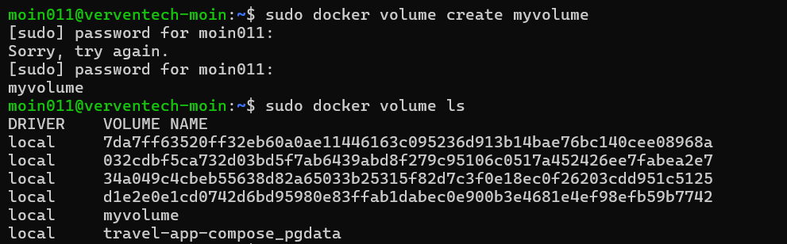
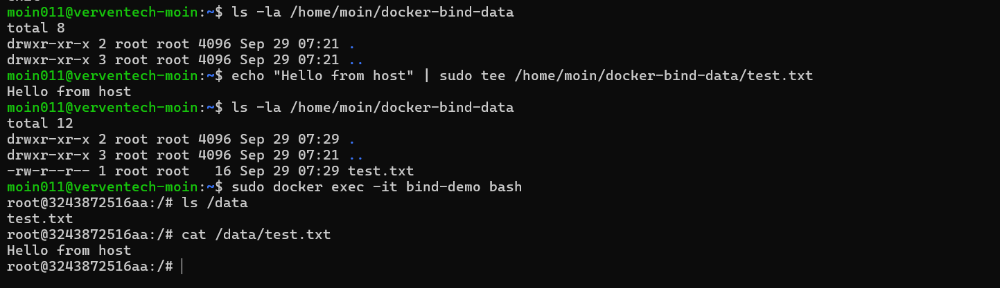
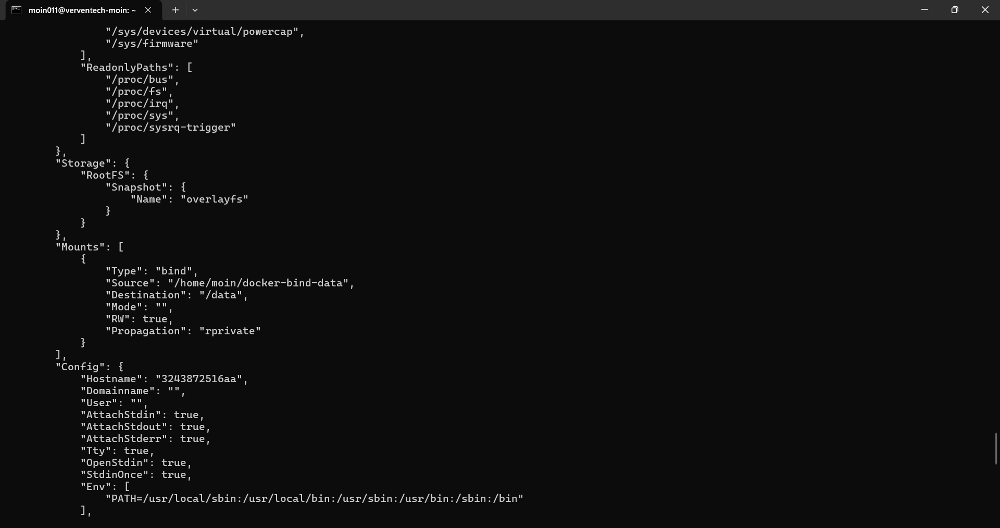

# Docker Storage

Docker containers are temporary by nature. Data stored inside a container can be lost when the container is removed.

Docker provides storage options to persist data. Two basic options are:

- Docker Volumes
- Bind Mounts

---

## 1. Docker Volume

A **Docker volume** is storage managed by Docker and stored separately from the container's writable layer.

### Create a Volume

```bash
sudo docker volume create myvolume
sudo docker volume ls
```



### Use a Volume with a Container

A volume can be mounted to a container using the `-v` option:

```bash
sudo docker run -d --name volume-demo -v myvolume:/data ubuntu
```

Check the volume mount:

```bash
sudo docker inspect volume-demo
```

The `Mounts` section shows the volume attached to the container.


---

## 2. Bind Mount

A **bind mount** maps a specific directory or file from the host system into a container.

For this example, the host directory is:

```text
/home/moin/docker-bind-data
```

Create a file on the host:

```bash
echo "Hello from host" | sudo tee /home/moin/docker-bind-data/test.txt
```

The directory is mounted inside the container at:

```text
/data
```

Access the container:

```bash
sudo docker exec -it bind-demo bash
```

Check the mounted directory:

```bash
ls /data
cat /data/test.txt
```



The file created on the host is available inside the container because of the bind mount.

### Verify the Bind Mount

```bash
sudo docker inspect bind-demo
```

The `Mounts` section shows:

```text
"Type": "bind"
"Source": "/home/moin/docker-bind-data"
"Destination": "/data"
```



---

## Volume vs Bind Mount

| Feature | Volume | Bind Mount |
|---|---|---|
| Managed by Docker | Yes | No |
| Host path required | No | Yes |
| Docker-managed storage | Yes | No |
| Direct host access | No | Yes |
| Useful for persistent data | Yes | Yes |

---

## Useful Commands

### Docker Volume

```bash
sudo docker volume create myvolume
sudo docker volume ls
sudo docker volume inspect myvolume
sudo docker volume rm myvolume
```

### Bind Mount

```bash
sudo docker run -it --name bind-demo \
-v /home/moin/docker-bind-data:/data ubuntu
```

---

## Summary

- **Volume** → Docker-managed storage used to persist data.
- **Bind mount** → Maps a specific host directory or file into a container.
- Both allow data to exist outside the container's writable layer.